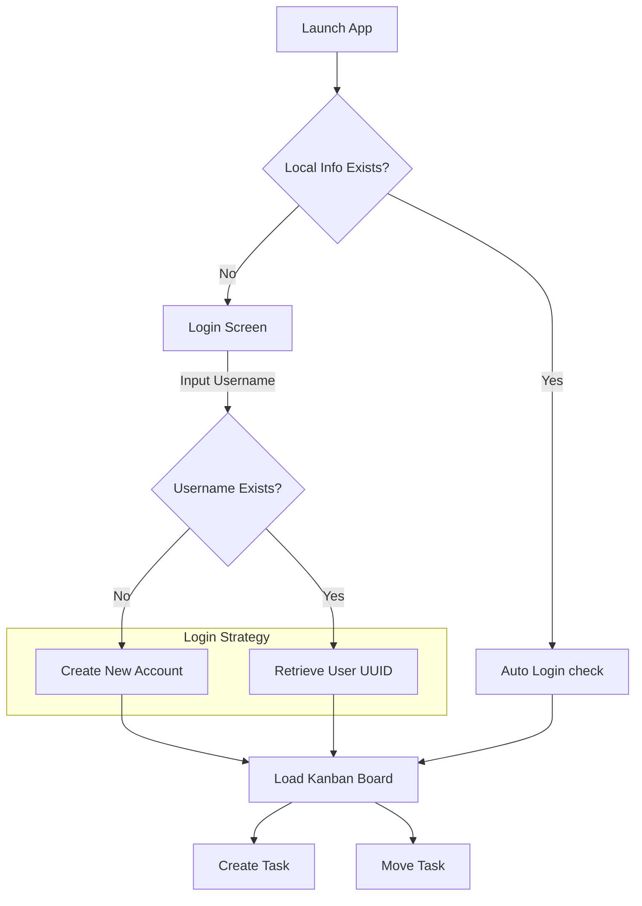

# UI/UX Design Specification: iOS Kanban Board

## 1. Design Philosophy
- **Concept**: "Fluid & Glass"
- **Keywords**: Translucent, Haptic, Bouncy, Minimal
- **Reference**: Apple Reminders App, Trello (iOS), Notion (iOS)

## 2. User Flow (Mermaid)

## 3. Screen Details

### 3.1 Login Screen (Simple Auth)
- **Concept**: "Just enter your name"
- **Components**:
    - **Logo**: Minimalist App Icon with Glass effect.
    - **Input**: "How should we call you?" (Username).
    - **Action**: "Start" Button (No Password).
    - **Feedback**: "Welcome back, {Name}!" or "Nice to meet you, {Name}!".

### 3.2 Kanban Board (Main)
- **Layout**: Horizontal Scrollable Columns.
- **Columns**: "To Do", "In Progress", "Done".
- **Card Item**:
    - White/Dark Gray rounded rectangle.
    - Subtle shadow (iOS shadow style).
    - Status Indicator (Color dot).
- **Interactions**:
    - Long press to drag.
    - Haptic feedback on drag start/end.
    - Scale up (1.05x) on drag.

## 4. Color Palette (Cupertino)
| Name | Light Mode | Dark Mode | Usage |
| :--- | :--- | :--- | :--- |
| **Background** | `SystemGroupedBackground` | `SystemGroupedBackground` | Main Page BG |
| **Card BG** | `SystemBackground` | `SecondarySystemGroupedBackground` | Task Cards |
| **Accent** | `SystemBlue` | `SystemBlue` | Buttons, Active States |
| **Text** | `Label` | `Label` | Primary Text |
