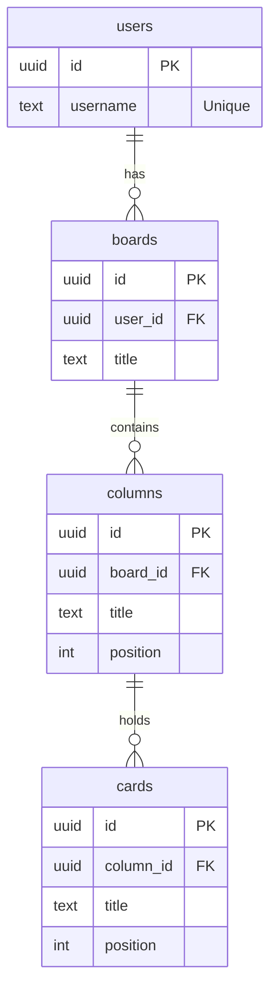

# 데이터 정의서 (Data Schema Specification)

## 1. 개요
*   **Database**: Supabase (PostgreSQL)
*   **Auth Strategy**: "Anonymous" Name-based Login.
    *   사용자 이름(Username)을 키로 사용하여 UUID를 조회하거나 생성합니다.
    *   비밀번호 없이 이름만으로 접근하므로, 개인용/데모용 프로젝트에 적합한 구조입니다.

## 2. 테이블 구조 (Tables)

### 2.1 `users` (사용자)
가입 절차 없이 이름으로 식별되는 사용자 테이블입니다.

| Column Name | Type | Key | Description |
| :--- | :--- | :--- | :--- |
| `id` | `uuid` | PK | Primary Key (Default: `gen_random_uuid()`) |
| `username` | `text` | Unique | 사용자 입력 이름 (중복 불가) |
| `created_at` | `timestamptz` | | 계정 생성 일시 |

### 2.2 `boards` (칸반 보드)
사용자는 여러 개의 보드를 가질 수 있습니다. (초기 버전은 1인 1보드여도 확장성 고려)

| Column Name | Type | Key | Description |
| :--- | :--- | :--- | :--- |
| `id` | `uuid` | PK | 보드 ID |
| `user_id` | `uuid` | FK | `users.id` 참조 (On Delete Cascade) |
| `title` | `text` | | 보드 이름 (예: "Personal", "Work") |
| `created_at` | `timestamptz` | | 생성 일시 |

### 2.3 `columns` (컬럼)
각 보드 내의 상태 컬럼 (예: To Do, In Progress, Done)

| Column Name | Type | Key | Description |
| :--- | :--- | :--- | :--- |
| `id` | `uuid` | PK | 컬럼 ID |
| `board_id` | `uuid` | FK | `boards.id` 참조 |
| `title` | `text` | | 컬럼 이름 |
| `position` | `int` | | 가로 정렬 순서 (0, 1, 2...) |

### 2.4 `cards` (할 일 카드)
실제 할 일 항목들입니다.

| Column Name | Type | Key | Description |
| :--- | :--- | :--- | :--- |
| `id` | `uuid` | PK | 카드 ID |
| `column_id` | `uuid` | FK | `columns.id` 참조 |
| `title` | `text` | | 할 일 제목 |
| `description` | `text` | | 상세 내용 (선택) |
| `position` | `int` | | 컬럼 내 세로 정렬 순서 |
| `created_at` | `timestamptz` | | 생성 일시 |

## 3. 관계도 (ER Diagram)

